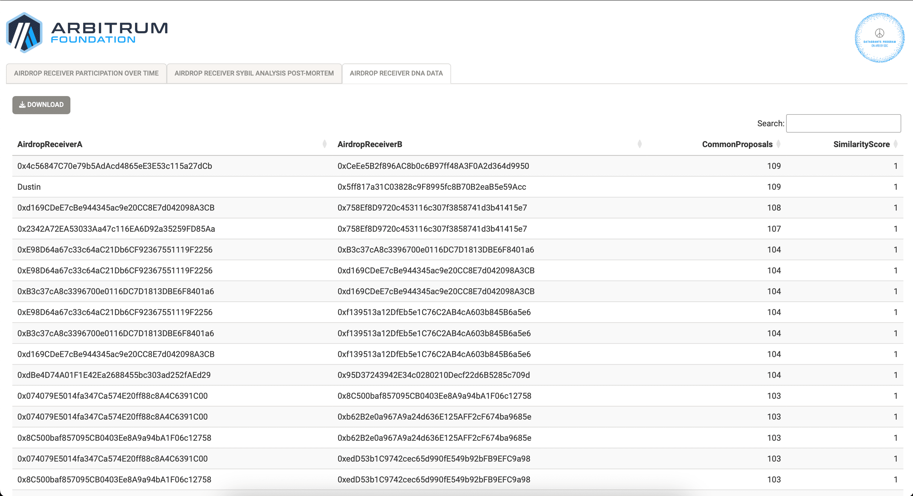

# AirdropSybilAnalysisPostMortem
This repository is designed to meticulously investigate the engagement of Airdrop recipients following the distribution event, scrutinizing their voting patterns for similarities that may indicate Sybil behavior.

## [App Demo on YouTube](https://www.youtube.com/watch?v=7DKxPKGqFSE) <<< Click Here

## [App deployed on a tiny droplet](http://143.198.234.235:4569) <<< Click Here

### Description
To kickstart this bounty, we gathered data on Arbitrum airdrop receiver user list, Snapshot & Tally data, channeling these insights into separate repositories. These repositories not only serve as foundational data sources for our current and future bounty submissions but also offer a rich starting point for any subsequent analysis, inviting the community to delve into the nuances of decentralized governance with ease.

## [SnapShot Proposal and Votes Data Scrape Pipeline Repo](https://github.com/yogesh-bansal/ArbSnapshotData)

ArbSnapshotData Repo

&nbsp;
&nbsp;

## [Tally Proposal, Votes and Deelgaets Data Scrape Pipeline Repo](https://github.com/yogesh-bansal/ArbTallyData)

ArbTallyData Repo

&nbsp;
&nbsp;

### Walkthrough

Our `AirdropSybilAnalysisPostMortem` repo contains a shiny app which analyzes and visualizes data to uncover Arbitrum Airdrop receiver participation over time in governance data and any potential sybil behaviour from them.

#### 1. Preprocess Data for the app

- `Rscript DNAdataCalcRaw.R`
- `Rscript PlotPrep.R`

#### 2. Start the Shiny App

- Open R console and Type `shiny::runApp()`

Arbitrum Airdrop receiver users participation in governance over time

&nbsp;
&nbsp;

Network showing users voting in a similar panel based on similarity & Covoted proposals cutoff based on voterDNA

&nbsp;
&nbsp;

Raw Data export of all user pairs with their Number of Covoted proposals & Similarity Score based on voterDNA

